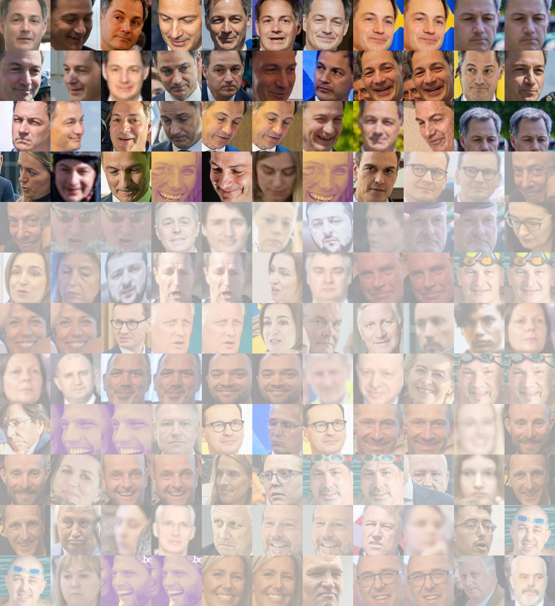

# Twitter Face Ratio Computer

## Scope

This project is a data visualization project  aiming to compute the ratio of appearance of a given face among all the tweets of a given account.

## Workflow

1. Get the *n* latest tweets of a given Twitter account by using the official Twitter API
2. Download all the images shared in the tweets
3. Extract all the faces from the images by using [OpenCV](https://pypi.org/project/opencv-python/)
4. Encode the faces based on the [face_recognition](https://pypi.org/project/face-recognition/) library
5. Sort the faces based on their similarity with the encoding of a reference image
6. Grey out the faces whose similarity is below a threshold of 0.9 (customisable)
7. Build a mosaic of the transformed faces

## Usage

- Create a Python virtual environment (> 3.9) and activate it
- Create a [Dev API account (V1.1)](https://developer.twitter.com/en/docs/twitter-api/v1) on Twitter and fill the `credentials.json` accordingly
- `pip install -r requirements.txt`
- `python main.py`

### Example

```
python main.py

Please indicate a Twitter screen name to analyse:
> alexanderdecroo

Please indicate an URL to the reference face:
> https://pbs.twimg.com/profile_images/1417706888012177409/bcgrpXJm_400x400.jpg

Please insert a similarity threshold (suggested: 0.9):
> 0.9

How many tweets do you want to analyse (max = 3200)?
> 200

200 tweets found
121 images found

-------------------------------

Ratio of faces corresponding to the reference face: 29.93 %
The mosaic has been generated : examples/alexanderdecroo.png
```
The resulting image is a mosaic containing all the faces from the tweets. The faces that are not corresponding to the reference face are grayed out.



## Author

Louis de Viron - [DataText SRL](https://www.datatext.eu)

## Credentials

This tool is mainly based on the following python libraries:
- [opencv-python](https://pypi.org/project/opencv-python/)
- [face_recognition](https://pypi.org/project/face-recognition/)
